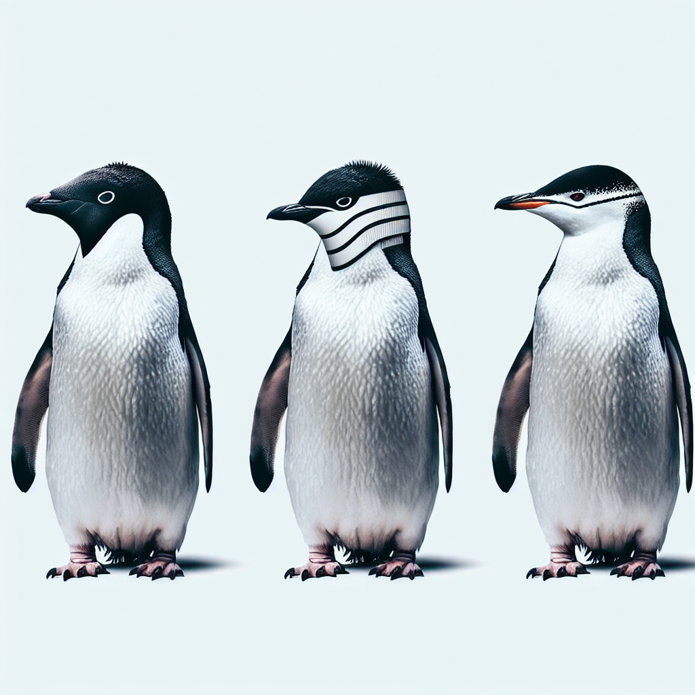

# Palmer Penguins Prediction App

This repository contains a Streamlit web application for predicting the species of Palmer penguins based on user-input features. The app utilizes a Random Forest Classifier trained on the Palmer penguins dataset.

  

## Overview

The Palmer Penguins Prediction App is designed to provide users with a user-friendly interface for predicting the species of Palmer penguins. Users can input features such as the island, sex, bill dimensions, flipper length, and body mass, either manually or by uploading a CSV file. The app then applies a trained Random Forest Classifier to make predictions and displays the predicted penguin species along with prediction probabilities.

## Data Source

The dataset used in this project is obtained from the [palmerpenguins library](https://github.com/allisonhorst/palmerpenguins) in R by Allison Horst. This dataset contains information about penguins collected by Dr. Kristen Gorman and the Palmer Station, Antarctica LTER. It includes features such as species, island, bill dimensions, flipper length, body mass, and sex.

## Penguin Species Information

### Adelie Penguins
Adelie penguins are one of the three species included in the Palmer penguins dataset. Here are some key characteristics:
- **Habitat**: Adelie penguins primarily inhabit the coastal areas of Antarctica.
- **Appearance**: They have a black head and back with a white belly, and they are the smallest of the three species.
- **Behavior**: Adelie penguins are known for their curious and energetic behavior, often forming large breeding colonies.

### Chinstrap Penguins
Chinstrap penguins are another species found in the Palmer penguins dataset. Here's what you need to know about them:
- **Habitat**: Chinstrap penguins are found in the Antarctic Peninsula and nearby islands.
- **Appearance**: They have a distinctive black line under their chin, giving them their name. They are medium-sized penguins.
- **Behavior**: Chinstrap penguins are agile swimmers and often hunt for fish, squid, and krill in the waters surrounding their colonies.

### Gentoo Penguins
Gentoo penguins are the third species included in the Palmer penguins dataset. Here are some facts about them:
- **Habitat**: Gentoo penguins inhabit various locations around the Antarctic Peninsula and nearby islands.
- **Appearance**: They have a white patch above their eyes and a wide orange beak. They are the largest of the three species.
- **Behavior**: Gentoo penguins are known for their loud vocalizations and elaborate courtship rituals. They build nests using rocks and pebbles and can dive to great depths in search of food.

For more detailed information about each penguin species and their habitats, behaviors, and conservation status, please refer to reputable sources such as scientific journals and conservation organizations.

## References

- **Data Providers**:
  - Data collected and made available by Dr. Kristen Gorman and the Palmer Station, Antarctica LTER.
  - Data obtained from the [palmerpenguins library](https://github.com/allisonhorst/palmerpenguins) in R by Allison Horst.

- **Encoding of Ordinal Features**:
  - The encoding of ordinal features is based on the methods described in the Kaggle notebook titled [Penguin Dataset - EDA, Classification, and Clustering](https://www.kaggle.com/pratik1120/penguin-dataset-eda-classification-and-clustering).

## Usage

To use the Palmer Penguins Prediction App, follow these steps:

1. Clone the repository to your local machine.
2. Install the required Python packages by running `pip install -r requirements.txt`.
3. Run the Streamlit app using the command `streamlit run app.py`.
4. Access the app in your web browser and start making predictions.

## Acknowledgments

- Special thanks to Dr. Kristen Gorman, Allison Horst, and the Palmer Station, Antarctica LTER for providing the Palmer penguins dataset.
- Credits to Pratik Patil for the insightful Kaggle notebook on penguin dataset analysis and classification.
